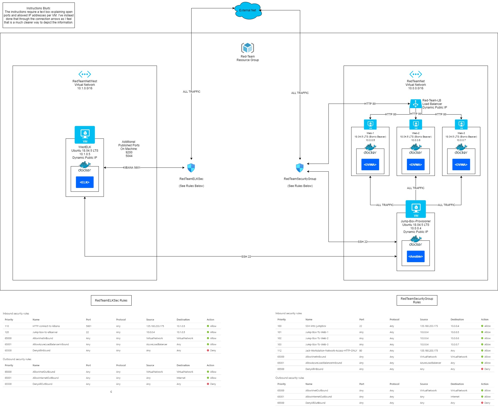
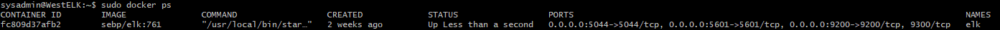

## Automated ELK Stack Deployment

The files in this repository were used to configure the network depicted below. 

These files have been tested and used to generate a live ELK deployment on Azure. They can be used to either recreate the entire deployment pictured above. Alternatively, select portions of the ansible/main.yml file may be used to install only certain pieces of it, such as Filebeat.

This document contains the following details:
- Description of the Topology
- Access Policies
- ELK Configuration
  - Beats in Use
  - Machines Being Monitored
- How to Use the Ansible Build

### Description of the Topology

The main purpose of this network is to expose a load-balanced and monitored instance of DVWA, the D*mn Vulnerable Web Application.

Load balancing ensures that the application will be highly available, in addition to restricting acess to the network.

Integrating an ELK server allows users to easily monitor the vulnerable VMs for changes to the system files.

The configuration details of each machine may be found below.

| Name     | Function | IP Address | Operating System |
|----------|----------|------------|------------------|
| Jump Box | Gateway  | 10.0.0.4   | Linux            |
| Web1     | Webserver| 10.0.0.5   | Linux            |
| Web2     | Webserver| 10.0.0.6   | Linux            |
| Web3     | Webserver| 10.0.0.7   | Linux            |
| WestELK  | ELK Stack| 10.1.0.5   | Linux            |

### Access Policies

The machines on the internal network are not exposed to the public Internet. 

Only the Jump Box machine can accept connections from the Internet. Access to this machine is only allowed from the following IP addresses:
- 135.180.203.175

Machines within the network can only be accessed by the jump box.
- 10.0.0.4

A summary of the access policies in place can be found in the table below.

| Name     | Publicly Accessible | Allowed IP Addresses |
|----------|---------------------|----------------------|
| Jump Box | No                  | 135.180.203.175      |
| Web1     | No                  | 10.0.0.4             |
| Web2     | No                  | 10.0.0.4             |
| Web3     | No                  | 10.0.0.4             |
| WestELK  | No                  | 10.0.0.4             |

### Elk Configuration

Ansible was used to automate configuration of the ELK machine. No configuration was performed manually, which is advantageous because if copies are needed their deployments will be almost completely automated.

The playbook implements the following tasks:
- Install docker.io
- Install python3-pip
- Install docker pip module
- Increase to and use minimum necessary virtual memory
- Download and launch a docker elk container

The following screenshot displays the result of running `docker ps` after successfully configuring the ELK instance.

### Target Machines & Beats
This ELK server is configured to monitor the following machines:
- Web1 10.0.0.5
- Web2 10.0.0.6
- Web3 10.0.0.7

We have installed the following Beats on these machines:
- filebeat

These Beats allow us to collect the following information from each machine:
- filebeat collects information on changes to important files.

### Using the Playbook
In order to use the playbook, you will need to have an Ansible control node already configured. Assuming you have such a control node provisioned: 

SSH into the control node and follow the steps below:
- Copy the Ansible directory to /etc/ansible on your ansible node
- Update hosts to specify addresses of webservers and elkservers
- Edit Ansible/roles/install-filebeat/files/filebeat-config.yml lines 1105 and 1805 to point at your ELK server address
- Execute playbook main.yml to install ELK stack on ELK server and DVWA + filebeat on Webservers
- Connect to (elk stack public IP):5601 to verify the ELK server is running
